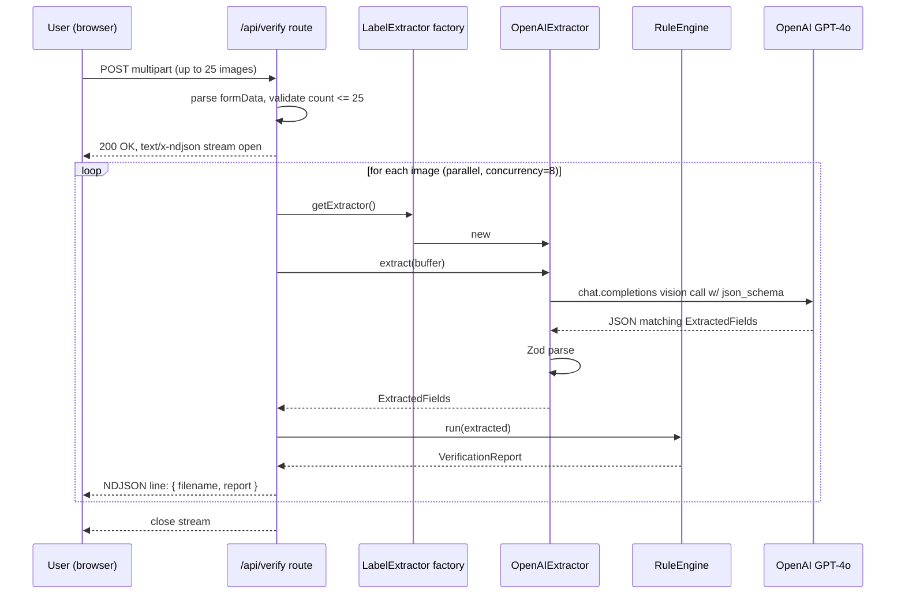

> Historical plan: kept for design history. `README.md` documents the current
> deployable architecture.

# feat: TTB Label Verification Prototype

## Summary

Greenfield Next.js 15 app that accepts one or many alcohol-label images, extracts the regulated fields with GPT-4o Vision, validates them against TTB compliance rules (with character-exact matching on the Government Warning statement), and streams per-label pass/fail results back to the user. Built on the U.S. Web Design System for federal authenticity and WCAG 2.1 AA compliance. Cloud LLM today, single-env-var swap to Azure OpenAI for the production sovereignty path.

This is a take-home submission for the U.S. Treasury / TTB. The deadline is **2026-06-10**. The evaluation rewards (1) a working deployed demo, (2) honest narrative on the firewall constraint, (3) code quality and accessibility.

---

## Problem Frame

TTB compliance reviewers manually check alcohol beverage labels against federal label requirements (27 CFR Part 4, 5, 7, and 16). The brief asks for a standalone prototype that extracts regulated fields and validates them automatically. The previous vendor's scanner took 30–40s per label and was blocked by government network firewalls during pilot — the brief deliberately surfaces this as the constraint to reason about.

See origin: `docs/brainstorms/2026-06-09-ttb-label-verify-requirements.md`.

---

## Scope Boundaries

### In scope (this plan)

- Single + batch upload (up to 25 labels in one batch)
- Six verification elements: brand name, ABV, Government Warning (exact text), net contents, class/type, producer + country of origin
- Per-label streamed results with pass/fail verdict, field-level extraction, plain-English failure reasons
- Government Warning treated as the high-stakes check — character-exact comparison + LLM judgment on visual bold/caps styling (flagged as a known weak spot)
- Downloadable JSON + CSV batch report
- Password-gated public Vercel demo, USWDS UI throughout, official USA banner
- `LabelExtractor` interface with `OpenAIExtractor` implementation + `AzureOpenAIExtractor` stub
- README covering setup, assumptions, trade-offs, Azure migration path, "what we'd do with more time"

### Deferred for later (not in 24h budget, would do with more time)

- Real Azure OpenAI implementation (stub class + documented swap is the substitute)
- Test corpus beyond ~5 sample labels
- Image annotation overlays on the original label
- Human-in-the-loop review UI (override/comment on AI verdicts)
- Confidence threshold tuning per field
- Persistent audit trail
- Batch sizes of 200–300 (would need queue worker, not serverless)

### Outside this product's identity

- COLA system integration — the brief is explicit this is standalone
- User accounts / SSO / role-based access — single shared password is by design
- Persistent PII storage — by design, no-PII constraint
- Dark mode — federal sites are light-mode; USWDS doesn't ship native dark
- Mobile-first design — TTB reviewers work on desktops; we ship responsive but desktop-optimized

### Deferred to Follow-Up Work

None — greenfield repo, no adjacent code to refactor.

---

## Key Technical Decisions

**Next.js 15 App Router on Vercel.** Single deployable, route handlers for the streaming verify endpoint, middleware for the password gate. Vercel deploy is one git push.

**OpenAI GPT-4o Vision, not Anthropic.** Treasury procurement may not have Anthropic approved; OpenAI is broadly federally-acceptable and the SDK is identical against Azure OpenAI. Anthropic ruled out explicitly. (See origin.)

**USWDS via `@trussworks/react-uswds`.** Federal design language, Section 508 / WCAG 2.1 AA out of the box, used by login.gov-adjacent contractors. No Tailwind (conflicts with USWDS preflight). Light mode only.

**Streaming via `ReadableStream` + NDJSON, not SSE or RSC streaming.** Route handler returns `text/x-ndjson`, one JSON object per completed label. Client reads with `fetch().body.getReader()` + a line-buffered parser. Simpler than SSE (no `EventSource` reconnection logic, no message-event framing), survives Vercel function timeouts better than RSC streaming, and keeps the result-card lifecycle plain React state. RSC streaming was considered and rejected as over-engineering for 24h.

**Validation rules as `Rule` objects (Open/Closed).** Each rule is a self-contained module implementing `check(extracted: ExtractedFields): RuleResult`. Adding a rule means adding a file, not editing an engine. The Government Warning rule owns the canonical TTB text constant.

**Provider abstraction (Dependency Inversion).** The verify route handler depends on the `LabelExtractor` interface, not on `OpenAIExtractor`. A factory keyed by `LABEL_EXTRACTOR` env var returns the right implementation. `AzureOpenAIExtractor` is a stub that throws `NotImplementedError` rather than returning mock data — Liskov-safe.

**Middleware-based password gate.** Signed HTTP-only cookie set by a `/login` form. One file to remove for real-auth swap.

**Vitest, not Jest.** Modern, fast, Vite-native. Tests cover the deterministic layers — validation rules, ttb-constants, NDJSON parser, export formatters, factory. The LLM extraction call is treated as a seam (we own the prompt and the Zod-validated parse, not the model). No E2E in 24h; manual axe + Lighthouse audit substitutes.

**Sass for USWDS theming.** USWDS ships SCSS tokens; Next.js 15 supports Sass natively. `globals.scss` imports the USWDS settings + theme.

**Langfuse for observability + evals, not LangSmith.** LangSmith has slightly nicer polish but no community self-host. Langfuse is OSS-first, runs in Docker Compose, deploys to Azure Container Apps trivially. The whole sovereignty narrative breaks if we add a second SaaS dependency the firewall blocks and that has no swap path. Production path: `LANGFUSE_HOST=https://langfuse.internal.treasury.gov` and the same SDK works unchanged. Langfuse client is a no-op when keys are absent — the demo never breaks because tracing is unavailable.

**TS strict mode, no `any`, no `@ts-ignore`.** Zod schemas at every boundary (LLM response, form payload, env vars).

---

## High-Level Technical Design

This illustrates the intended approach and is directional guidance for review, not implementation specification. The implementing agent should treat it as context, not code to reproduce.

### Verify flow (one label)



### Rule engine shape

```text
type RuleResult = { status: 'pass' | 'fail' | 'uncertain'; reason?: string };
interface Rule { id: string; label: string; check(e: ExtractedFields): RuleResult; }

// engine.ts
export function runRules(rules: Rule[], extracted: ExtractedFields): VerificationReport
```

Government Warning rule normalizes whitespace, compares character-exact against the constant, and reports the precise mismatch (missing prefix, missing sentence 2, etc.) in the `reason`.

---

## Output Structure

The plan creates this directory layout. The per-unit `Files:` sections remain authoritative; this is the overall shape for orientation.

```text
ttb-label-verify/
├── README.md
├── package.json
├── tsconfig.json
├── next.config.mjs
├── eslint.config.mjs
├── vitest.config.ts
├── .env.example
├── public/
│   └── samples/
│       ├── compliant-bourbon.jpg
│       ├── missing-warning.jpg
│       └── wrong-abv.jpg
├── src/
│   ├── app/
│   │   ├── layout.tsx
│   │   ├── page.tsx
│   │   ├── globals.scss
│   │   ├── login/page.tsx
│   │   └── api/
│   │       ├── auth/route.ts
│   │       └── verify/route.ts
│   ├── middleware.ts
│   ├── components/
│   │   ├── gov-banner.tsx
│   │   ├── page-header.tsx
│   │   ├── upload-zone.tsx
│   │   ├── staged-files-list.tsx
│   │   ├── results-grid.tsx
│   │   ├── result-card.tsx
│   │   ├── summary-bar.tsx
│   │   ├── warning-diff.tsx
│   │   └── about-modal.tsx
│   └── lib/
│       ├── env.ts
│       ├── extraction/
│       │   ├── types.ts
│       │   ├── prompt.ts
│       │   ├── openai-extractor.ts
│       │   ├── azure-openai-extractor.ts
│       │   └── factory.ts
│       ├── validation/
│       │   ├── types.ts
│       │   ├── ttb-constants.ts
│       │   ├── engine.ts
│       │   └── rules/
│       │       ├── brand.ts
│       │       ├── abv.ts
│       │       ├── government-warning.ts
│       │       ├── net-contents.ts
│       │       ├── class-type.ts
│       │       └── producer-origin.ts
│       ├── observability/
│       │   ├── langfuse.ts
│       │   └── spans.ts
│       ├── streaming/
│       │   └── ndjson.ts
│       ├── upload/
│       │   ├── file-validation.ts
│       │   ├── phase-reducer.ts
│       │   └── format-bytes.ts
│       ├── results/
│       │   ├── result-types.ts
│       │   ├── stream-consumer.ts
│       │   └── aggregate.ts
│       ├── diff/
│       │   └── warning-diff.ts
│       └── export/
│           ├── json-formatter.ts
│           └── csv-formatter.ts
├── evals/
│   ├── README.md
│   ├── run.ts
│   ├── dataset/
│   │   ├── index.ts
│   │   ├── compliant-bourbon.json
│   │   ├── missing-warning.json
│   │   ├── wrong-abv-format.json
│   │   ├── partial-extraction.json
│   │   ├── edge-case-foreign-import.json
│   │   └── images/
│   │       ├── compliant-bourbon.jpg
│   │       ├── missing-warning.jpg
│   │       ├── wrong-abv-format.jpg
│   │       ├── partial-extraction.jpg
│   │       └── edge-case-foreign-import.jpg
│   └── evaluators/
│       ├── field-extraction-accuracy.ts
│       └── government-warning-match.ts
└── docs/
    ├── brainstorms/2026-06-09-ttb-label-verify-requirements.md
    └── plans/2026-06-09-001-feat-ttb-label-verify-plan.md
```

---

## Implementation Units

### U1. Project scaffold + dependencies + tooling

**Goal:** Bootable Next.js 15 app with TypeScript strict, USWDS SCSS pipeline, env validation, linting, and Vitest. No feature code yet — just the foundation everything else lands on.

**Requirements:** All — this is the substrate.

**Dependencies:** None.

**Files:**

- `package.json` (create)
- `tsconfig.json` (create — `strict: true`, `noUncheckedIndexedAccess: true`)
- `next.config.mjs` (create — Sass options for USWDS include paths)
- `eslint.config.mjs` (create — `eslint-config-next` + `@typescript-eslint/no-explicit-any: error`)
- `vitest.config.ts` (create)
- `.env.example` (create — `OPENAI_API_KEY`, `DEMO_PASSWORD`, `DEMO_PASSWORD_COOKIE_SECRET`, `LABEL_EXTRACTOR`, `AZURE_OPENAI_ENDPOINT`, `AZURE_OPENAI_API_KEY`)
- `src/lib/env.ts` (create — Zod-validated env loader)
- `src/app/layout.tsx` (create — minimal shell, imports `globals.scss`)
- `src/app/page.tsx` (create — placeholder "Hello TTB" for now)
- `src/app/globals.scss` (create — imports USWDS settings, theme, all)
- `README.md` (create — skeleton)

**Approach:**

- `npm create next-app@latest` style scaffold but write the files by hand to keep them minimal — no example boilerplate, no `src/app/favicon.ico` clutter, no Tailwind.
- Install: `next@15`, `react@19`, `react-dom@19`, `@trussworks/react-uswds`, `@uswds/uswds`, `sass`, `openai`, `zod`, `p-limit`, `jose` (for signed cookies), `vitest`, `@vitest/coverage-v8`, `@types/react`, `@types/node`, `typescript`, `eslint`, `eslint-config-next`, `prettier`.
- `next.config.mjs` sets `sassOptions.includePaths` to `['./node_modules/@uswds/uswds/packages']` so USWDS SCSS imports resolve.
- `globals.scss` follows the USWDS-recommended pattern: import `uswds-core` first with theme overrides, then `uswds`. No custom colors yet — use the default palette.
- `env.ts` exports a parsed `env` object via Zod with `.parse(process.env)` at module load. Throws on boot if anything required is missing. Distinguishes required vs optional (Azure vars only required when `LABEL_EXTRACTOR=azure-openai`).

**Patterns to follow:** Standard Next.js 15 App Router conventions. USWDS Sass setup per the trussworks/react-uswds README.

**Test scenarios:**

- Covers env contract. `env.ts` throws when `OPENAI_API_KEY` is missing. Passes when all required vars are set. `LABEL_EXTRACTOR=azure-openai` without `AZURE_OPENAI_ENDPOINT` throws with a clear message.

**Verification:** `npm run dev` boots without errors, `localhost:3000` shows the placeholder page styled in USWDS Public Sans. `npm run build` succeeds. `npm run lint` passes with zero warnings. `npm test` runs the env test and passes.

---

### U2. LabelExtractor interface + OpenAI implementation + Azure stub

**Goal:** The provider abstraction. Calling code depends on `LabelExtractor`; the env var picks the concrete class. Validates the LLM response with Zod so downstream rule code can trust the shape.

**Requirements:** Provider abstraction, structured field extraction (six fields), Azure swap path.

**Dependencies:** U1.

**Files:**

- `src/lib/extraction/types.ts` (create)
- `src/lib/extraction/prompt.ts` (create — the system + user prompt template)
- `src/lib/extraction/openai-extractor.ts` (create)
- `src/lib/extraction/azure-openai-extractor.ts` (create)
- `src/lib/extraction/factory.ts` (create)
- `src/lib/extraction/factory.test.ts` (create)
- `src/lib/extraction/openai-extractor.test.ts` (create — schema-validation tests only, no live LLM)

**Approach:**

- `types.ts` exports the `LabelExtractor` interface (`extract(image: Buffer, mimeType: string): Promise<ExtractedFields>`), the `ExtractedFieldsSchema` Zod schema, and the inferred `ExtractedFields` type.
- `ExtractedFields` shape: `{ brandName, abv, governmentWarning: { text, appearsAllCaps, appearsBold }, netContents, classType, producer, countryOfOrigin }`. Each is nullable + has an `extractionConfidence: 'high' | 'medium' | 'low'` sibling so rules can flag uncertainty.
- `prompt.ts` exports a `buildPrompt()` function that returns the system + user message structure. Prompt instructs the model to (a) read the label, (b) return JSON matching the schema, (c) return `null` for any field that's genuinely missing from the label (don't hallucinate), (d) judge the warning's visual styling honestly.
- `openai-extractor.ts` uses the `openai` SDK with `chat.completions.create`, `model: 'gpt-4o'`, `response_format: { type: 'json_schema', json_schema: ... }` (structured outputs). Passes the image as a base64 data URL in the user message. Parses the response with `ExtractedFieldsSchema.parse()`. Throws on schema violation — the caller decides how to surface.
- `azure-openai-extractor.ts` exports a class with the same interface but throws `NotImplementedError('AzureOpenAIExtractor is documented but not implemented in the prototype. See README "Azure migration path".')` from `extract()`. Documents the constructor signature so the swap is obvious.
- `factory.ts` exports `getExtractor()`: reads `env.LABEL_EXTRACTOR`, returns the appropriate instance. Throws on unknown value.

**Patterns to follow:** OpenAI structured outputs (json_schema response format) — current SDK pattern as of mid-2026. Zod for runtime validation. Provider-pattern (factory + interface) standard.

**Test scenarios:**

- `ExtractedFieldsSchema` accepts a fully-populated valid object.
- `ExtractedFieldsSchema` accepts an object with all fields nulled (label was unreadable).
- `ExtractedFieldsSchema` rejects when a required string field is a number.
- `factory.getExtractor()` returns an `OpenAIExtractor` when `LABEL_EXTRACTOR=openai`.
- `factory.getExtractor()` returns an `AzureOpenAIExtractor` when `LABEL_EXTRACTOR=azure-openai`.
- `factory.getExtractor()` throws on unknown value.
- `AzureOpenAIExtractor.extract()` throws `NotImplementedError` with the documented message.

**Verification:** `npm test src/lib/extraction` passes. Type-check clean. A manual `tsx src/lib/extraction/openai-extractor.ts` smoke script against one sample image returns a parsed object (manual only, not in CI).

---

### U2.5. Observability + evals on the extraction layer

**Goal:** Every extraction call is traced to Langfuse with inputs, prompt, response, latency, tokens, and cost. A small committed eval dataset + two evaluators run via `npm run eval`, post results to Langfuse, and fail when extraction precision drops. The LLM is treated as a versioned dependency we measure, not a magic box.

**Requirements:** AI-layer observability for production debugging; eval rigor to catch model/prompt regressions; the sovereignty narrative extends to the observability stack (Langfuse is self-hostable, LangSmith was rejected for this reason — see Key Technical Decisions).

**Dependencies:** U2 (extractor + factory).

**Execution note:** Add observability _before_ writing the rule engine in U3 so that during U3+U4 development, every extractor call is already producing traces — useful for debugging the prompt iteratively.

**Files:**

- `src/lib/observability/langfuse.ts` (create — singleton client + `observeOpenAI()` wrap, no-op when keys absent)
- `src/lib/observability/spans.ts` (create — helpers: `withRequestSpan(name, fn)`, `withLabelSpan(filename, fn)`)
- `src/lib/observability/langfuse.test.ts` (create — verifies no-op behavior when keys absent; doesn't hit network)
- `src/lib/extraction/openai-extractor.ts` (modify — use the wrapped client from `observability/langfuse.ts`)
- `evals/dataset/index.ts` (create — exports the dataset as typed `EvalCase[]`)
- `evals/dataset/compliant-bourbon.json` (create — image ref + expected `ExtractedFields`)
- `evals/dataset/missing-warning.json` (create)
- `evals/dataset/wrong-abv-format.json` (create)
- `evals/dataset/partial-extraction.json` (create — label where some fields are genuinely missing)
- `evals/dataset/edge-case-foreign-import.json` (create — non-US producer, non-English on label)
- `evals/evaluators/field-extraction-accuracy.ts` (create — per-field precision: 1.0 if extracted matches expected, 0.0 if differs, null skipped if expected was null)
- `evals/evaluators/field-extraction-accuracy.test.ts` (create)
- `evals/evaluators/government-warning-match.ts` (create — binary exact-match after whitespace normalization)
- `evals/evaluators/government-warning-match.test.ts` (create)
- `evals/run.ts` (create — orchestrator: load dataset, run extractor against each, score with both evaluators, post traces + scores to Langfuse, print local table, exit non-zero if aggregate field-accuracy < 0.85 or any warning-match fails)
- `evals/README.md` (create — what's in the dataset, how to add a case, how to read the scores)
- `package.json` (modify — add `"eval": "tsx evals/run.ts"` script and `tsx` devDependency)
- `.env.example` (modify — add `LANGFUSE_PUBLIC_KEY`, `LANGFUSE_SECRET_KEY`, `LANGFUSE_HOST=https://cloud.langfuse.com` with comments noting self-host swap path)
- `src/lib/env.ts` (modify — Langfuse vars are all optional; absence means tracing no-ops)

**Approach:**

- **Langfuse client (`observability/langfuse.ts`):** Singleton, lazy-initialized. On first access, reads the three Langfuse env vars; if any are missing, returns a no-op object whose methods are stubs. This way, the demo never breaks if Langfuse keys aren't set or the service is down. The `observeOpenAI()` wrapper from the `langfuse` SDK wraps the OpenAI client; the extractor in U2 swaps its `new OpenAI(...)` for `getObservedOpenAI()`.
- **Spans (`observability/spans.ts`):** `withRequestSpan` opens a `verify-request` trace at the route entry, `withLabelSpan(filename)` opens a child generation/span around each `extract()` call. Both are no-ops when Langfuse isn't configured. The route (U4) is updated to wrap its per-label work in `withLabelSpan(file.name, () => extractor.extract(...))`.
- **What's traced and what's NOT:** trace metadata = filename, MIME type, byte size, SHA-256 of the image (so duplicate-label calls correlate), prompt template version, model name, token usage, latency, Zod parse success/failure, rule engine verdict counts. Never the raw image bytes — privacy + payload size. The image SHA is the join key if you need to reproduce.
- **Dataset shape:** each `EvalCase` is `{ id, imagePath, expected: ExtractedFields, notes }`. Images live alongside the JSON in `evals/dataset/images/` (committed; small set, 5 files at ~200KB each is fine). Expected values are hand-authored from looking at the label.
- **Field extraction accuracy evaluator:** for each field in `expected`, compare to `actual`. Strings: case-insensitive equality after whitespace normalization. Nullable fields: if `expected === null`, the case is "model should have returned null"; if `actual !== null` that's a hallucination = score 0 for that field. Return per-field scores plus an aggregate (mean of present-field scores). Government Warning text is handled by the dedicated evaluator, not this one.
- **Government Warning match evaluator:** runs `government-warning` rule's normalize-and-compare logic against `expected.governmentWarning.text`. Binary score: 1 if `actual` matches `expected` (or both null), 0 otherwise. Reason on 0 explains the drift (same reason text the rule produces — share the implementation).
- **Eval runner (`evals/run.ts`):**
  1. Loads dataset
  2. For each case: reads the image, calls `extractor.extract()`, runs both evaluators
  3. Posts a Langfuse trace per case with the score attached
  4. Prints a local table: `case | field-accuracy | warning-match | latency | tokens`
  5. Aggregates: mean field-accuracy across cases; warning-match pass rate
  6. Exits 0 if aggregate field-accuracy ≥ 0.85 AND warning-match pass rate = 1.0; exits non-zero otherwise with a clear failure message
- **README treatment:** new section titled "Evals" — explains the dataset, shows a sample run output, explains how this catches model upgrades that silently regress. Frame it as: "We treat the LLM as a versioned dependency. We measure it."

**Patterns to follow:** `langfuse-node` SDK's `observeOpenAI()` wrap pattern (drop-in OpenAI client wrapper). Eval runner pattern: dataset → run → score → report (common across LangSmith / Langfuse / Promptfoo, the structure is portable if you ever swap).

**Test scenarios:**

**`field-extraction-accuracy.ts`** (pure):

- All fields match expected → aggregate score = 1.0, every field score = 1.0.
- One field differs → that field scores 0.0, others 1.0, aggregate reflects mean.
- Expected has `null`, actual has `null` → that field scored 1.0 (correctly absent).
- Expected has `null`, actual has a value → that field scored 0.0 (hallucination).
- Expected has a value, actual has `null` → that field scored 0.0 (missed extraction).
- String comparison ignores case and surrounding whitespace.
- Empty expected object → aggregate is `null` (no fields to score), not 0 or NaN.

**`government-warning-match.ts`** (pure):

- Exact canonical text in both → score 1, no reason.
- Whitespace-different but textually identical → score 1.
- Missing prefix in actual → score 0, reason names the missing prefix.
- Both `null` → score 1 (the label genuinely lacked one, model correctly said so).
- Expected `null`, actual present → score 0 (hallucinated warning).
- Reason text is identical to the corresponding `government-warning` rule's reason text (verified via shared helper).

**`observability/langfuse.ts`:**

- With no env vars set, `getObservedOpenAI()` returns a working OpenAI client (no-op wrap), `withLabelSpan` invokes its callback and returns the result, no network calls are made.
- With env vars set, the returned client is the observed wrapper (verified by checking SDK class identity, not by hitting the network).

**Verification:** `npm test evals/evaluators src/lib/observability` passes. `npm run eval` runs against the 5-case dataset, prints a table, posts traces to Langfuse Cloud, and exits 0 on a baseline run. Run the verify endpoint once after wiring — the Langfuse UI shows a `verify-request` trace with one `extract-label` child per uploaded image, each containing the prompt, model response, token usage, and the rule verdict counts as metadata.

---

**Goal:** Deterministic verification layer. Each TTB rule is a self-contained module. The Government Warning rule does the character-exact comparison that the brief makes high-stakes.

**Requirements:** All six verification elements; exact-text Government Warning check; per-field pass/fail reasons in plain English.

**Dependencies:** U2 (uses `ExtractedFields` type).

**Execution note:** Test-first. The validation logic is the most important correctness surface in the app and the easiest to get wrong. Write the test scenarios for each rule before the rule.

**Files:**

- `src/lib/validation/types.ts` (create)
- `src/lib/validation/ttb-constants.ts` (create)
- `src/lib/validation/engine.ts` (create)
- `src/lib/validation/engine.test.ts` (create)
- `src/lib/validation/rules/brand.ts` (create)
- `src/lib/validation/rules/abv.ts` (create)
- `src/lib/validation/rules/government-warning.ts` (create)
- `src/lib/validation/rules/net-contents.ts` (create)
- `src/lib/validation/rules/class-type.ts` (create)
- `src/lib/validation/rules/producer-origin.ts` (create)
- `src/lib/validation/rules/*.test.ts` (create one per rule)

**Approach:**

- `types.ts` exports: `RuleResult = { status: 'pass' | 'fail' | 'uncertain'; reason?: string; extractedValue?: string | null }`, `Rule = { id: string; label: string; check: (e: ExtractedFields) => RuleResult }`, `VerificationReport = { overallStatus: 'compliant' | 'needs_review'; fields: Record<string, RuleResult> }`.
- `ttb-constants.ts` exports `GOVERNMENT_WARNING_CANONICAL` — the verified TTB text:
  > `GOVERNMENT WARNING: (1) According to the Surgeon General, women should not drink alcoholic beverages during pregnancy because of the risk of birth defects. (2) Consumption of alcoholic beverages impairs your ability to drive a car or operate machinery, and may cause health problems.`
- `engine.ts` exports `runRules(extracted: ExtractedFields): VerificationReport`. Hard-codes the rule list (imports the six rule modules). Aggregates: any `fail` → `needs_review`; all `pass` → `compliant`; `uncertain` doesn't fail overall but is preserved per-field.
- Each rule file exports a `Rule` object as the default export. Approach per rule:
  - `brand.ts`: pass if `brandName` is non-empty. `uncertain` if extraction confidence was `low`. Reason on fail: "Brand name not detected on the label."
  - `abv.ts`: pass if `abv` matches `/^\d{1,2}(\.\d{1,2})?%?\s*(ALC\/VOL|ALCOHOL\s+BY\s+VOLUME)?$/i` OR if it's a parseable number. Reason on fail: "ABV missing or not in a recognized format."
  - `government-warning.ts`: normalize whitespace (`text.replace(/\s+/g, ' ').trim()` on both sides), then character-exact compare. On fail, compute a diff: detect missing prefix, missing sentence 1, missing sentence 2, or substantive text drift, and return a specific reason. Also surfaces `appearsBold === false` as an `uncertain` warning ("Warning text is correct, but may not be in bold as required.").
  - `net-contents.ts`: pass if `netContents` matches a unit pattern (`mL`, `L`, `fl oz`, `FL OZ`, `ml`, `l`). Reason on fail: "Net contents missing or unit not recognized."
  - `class-type.ts`: pass if `classType` is non-empty. (We don't validate against the TTB class catalogue in the prototype — out of scope.) Reason on fail: "Fanciful name not detected."
  - `producer-origin.ts`: pass if `producer` is non-empty AND `countryOfOrigin` is non-empty. Reason on fail names which side is missing.

**Patterns to follow:** Each rule is a single file, default export, no shared state. Engine has no knowledge of specific rules beyond the import list — Open/Closed.

**Test scenarios:**

**Government Warning rule** (the high-stakes one):

- Exact canonical text → `pass`.
- Canonical text with extra whitespace between sentences → `pass` (whitespace normalized).
- Missing `GOVERNMENT WARNING:` prefix → `fail` with reason `"The 'GOVERNMENT WARNING:' prefix is missing."`.
- Missing sentence (2) about driving → `fail` with reason naming the missing sentence.
- Sentence (1) with wrong phrasing ("might drink" instead of "should not drink") → `fail` with a substantive-drift reason.
- Canonical text but `appearsBold: false` → `uncertain` (not fail) with the bold-styling reason.
- Canonical text but `appearsAllCaps: false` on the prefix → `uncertain` with the caps-styling reason.
- `null` extracted text → `fail` with reason `"Government Warning not detected on the label."`.

**ABV rule:**

- `"40% ALC/VOL"` → `pass`.
- `"40.0% Alcohol by Volume"` → `pass`.
- `"40"` (just the number) → `pass`.
- `null` → `fail`.
- `"forty percent"` → `fail`.

**Brand rule:**

- Non-empty string → `pass`.
- `null` → `fail`.
- Non-empty but `extractionConfidence: 'low'` → `uncertain`.

**Net contents rule:**

- `"750 mL"` → `pass`.
- `"1.75 L"` → `pass`.
- `"25.4 fl oz"` → `pass`.
- `"big bottle"` → `fail`.
- `null` → `fail`.

**Class/type rule:**

- `"STRAIGHT BOURBON WHISKEY"` → `pass`.
- `null` → `fail`.

**Producer + origin rule:**

- Both non-empty → `pass`.
- Producer non-empty, country `null` → `fail` with reason naming "country of origin".
- Producer `null`, country non-empty → `fail` with reason naming "producer".
- Both `null` → `fail`.

**Engine integration:**

- All rules pass → report `overallStatus: 'compliant'`, all field statuses `pass`.
- Government Warning fails, others pass → `overallStatus: 'needs_review'`.
- All fields `uncertain`, none `fail` → `overallStatus: 'compliant'` (uncertain alone doesn't block — preserved per-field for the UI to surface).
- Empty `ExtractedFields` (all nulls) → `overallStatus: 'needs_review'`, every field `fail`.

**Verification:** `npm test src/lib/validation` passes with full per-rule coverage. The canonical Government Warning constant matches the TTB.gov source character-for-character.

---

### U4. NDJSON streaming utility + verify route handler

**Goal:** POST endpoint that accepts up to 25 images, extracts and validates each in parallel with concurrency control, and streams results as NDJSON.

**Requirements:** Batch ≤ 25, parallel processing, progressive results (no waiting on slowest), 5s/label target.

**Dependencies:** U2 (extractor), U2.5 (observability spans), U3 (engine).

**Files:**

- `src/lib/streaming/ndjson.ts` (create — utility for line-buffered NDJSON encode/decode)
- `src/lib/streaming/ndjson.test.ts` (create)
- `src/app/api/verify/route.ts` (create)

**Approach:**

- `ndjson.ts` exports `encodeNDJSON(obj): string` (JSON.stringify + `\n`) and a client-side `parseNDJSONStream(reader): AsyncIterable<unknown>` that handles partial-line buffering.
- `route.ts` is a Next.js route handler with `export const runtime = 'nodejs'` (Edge doesn't support enough OpenAI SDK features yet) and `export const maxDuration = 60`.
- POST handler:
  1. Wraps the whole handler in `withRequestSpan('verify-request', async () => { ... })` from U2.5 — root Langfuse trace for the batch
  2. Parses `multipart/form-data`, collects files into an array
  3. Validates count (1–25) — returns `400` with a clear error otherwise
  4. Validates each file's MIME type (`image/png`, `image/jpeg`, `image/webp`, `application/pdf`) and size (≤10 MB) — invalid files become immediate fail-result entries in the stream rather than rejecting the whole request
  5. Creates a `ReadableStream`. Inside the `start` callback, runs the work with `p-limit(8)` and writes each completed result as one NDJSON line via `controller.enqueue(new TextEncoder().encode(...))`. Per-label work wraps in `withLabelSpan(file.name, () => extractor.extract(...))`, then runs the rule engine, then attaches the verdict counts as span metadata.
  6. Each result line is `{ filename, status: 'ok' | 'error', report?: VerificationReport, errorMessage?: string, durationMs }`.
  7. Closes the stream when all done. Errors per-label do not abort siblings. Span helpers swallow Langfuse failures silently — a tracing outage never affects user-visible behavior.
- Sets response headers: `Content-Type: text/x-ndjson`, `Cache-Control: no-store`.

**Patterns to follow:** Next.js 15 route handler streaming pattern using `ReadableStream`. `p-limit` for concurrency.

**Test scenarios:**

**NDJSON utility:**

- `encodeNDJSON({a:1})` returns `"{\"a\":1}\n"`.
- `parseNDJSONStream` yields each complete JSON object from a stream split across chunk boundaries (e.g., a JSON object split across two chunks reassembles correctly).
- `parseNDJSONStream` ignores empty lines at end of stream.

**Route handler:**

- POST with zero files → `400` with reason "At least one label image is required."
- POST with 26 files → `400` with reason "Maximum 25 labels per batch."
- POST with one valid image (extractor mocked) → response is `text/x-ndjson`, body contains one parseable line with the expected report shape.
- POST with three valid images, one invalid (PDF that isn't actually a PDF) → response contains three NDJSON lines: two `status: 'ok'`, one `status: 'error'` for the invalid one. Other results still complete.
- POST with one image where the extractor throws → that file's line has `status: 'error'`, stream still closes cleanly.

Mock the `LabelExtractor` interface for these tests (DIP pays off — we inject a test extractor without touching OpenAI).

**Verification:** Endpoint streams results progressively (visible via `curl --no-buffer` showing lines arriving as each label finishes, not all at once). The first result arrives before the last one. Concurrency cap is respected (no more than 8 in-flight extractor calls).

---

### U5. Password gate (middleware + login page + auth route)

**Goal:** Public demo URL gated by `DEMO_PASSWORD` env var. Single-input form, signed cookie, redirects unauthorized requests to `/login`.

**Requirements:** Public deploy gated, single shared password, no real auth.

**Dependencies:** U1.

**Files:**

- `src/middleware.ts` (create)
- `src/app/login/page.tsx` (create — USWDS form)
- `src/app/api/auth/route.ts` (create)

**Approach:**

- Middleware matches all paths except `/login`, `/api/auth`, `/_next/*`, and static assets. Checks for a `demo-auth` cookie, verifies the signature with `jose` against `DEMO_PASSWORD_COOKIE_SECRET`, and either lets the request through or 307-redirects to `/login`.
- `/login` is a server component rendering a USWDS form with a single password `<TextInput type="password">`, an `<ErrorMessage>` placeholder, and a `<Button>` submit. Posts to `/api/auth`.
- `/api/auth` route: reads form data, constant-time compares the input to `env.DEMO_PASSWORD`, on match signs a JWT (1-week expiry) with `jose` and sets the cookie via `Set-Cookie` (HttpOnly, Secure, SameSite=Lax). On mismatch, redirects back to `/login?error=1`.

**Patterns to follow:** Next.js middleware pattern. `jose` for JWT signing (works in Edge runtime — middleware runs in Edge).

**Test scenarios:**

- Middleware redirects an unauthenticated request to `/` to `/login`.
- Middleware lets through a request with a valid cookie.
- Middleware lets through `/login` and `/api/auth` unconditionally.
- Middleware redirects when the cookie signature is invalid or expired.
- `/api/auth` with the correct password sets a valid signed cookie and redirects to `/`.
- `/api/auth` with the wrong password redirects to `/login?error=1` and does not set a cookie.
- Timing: password comparison uses constant-time equality (verify by reading the code; testing timing reliably is out of scope).

**Verification:** `curl localhost:3000/` returns 307 → `/login`. After posting the correct password and capturing the cookie, the next request to `/` returns 200. Wrong password keeps you on the login page.

---

### U6. UI shell — banner, header, empty-state upload zone, staged-files list

**Goal:** The user-visible part of the empty/staged states. Official USA banner, header, drop zone, file picker, file chip list, primary "Verify" button. Fully keyboard-accessible and screen-reader-friendly. Pure logic (file validation, phase reducer) extracted into testable modules.

**Requirements:** USWDS throughout, official banner, WCAG 2.1 AA, "73-year-old grandma" usability bar, sample-label affordance.

**Dependencies:** U1, U5 (so the page is gated).

**Files:**

- `src/lib/upload/file-validation.ts` (create — pure validation: count, MIME type, size)
- `src/lib/upload/file-validation.test.ts` (create)
- `src/lib/upload/phase-reducer.ts` (create — pure reducer for empty/staged/processing/done state machine)
- `src/lib/upload/phase-reducer.test.ts` (create)
- `src/lib/upload/format-bytes.ts` (create — pure "1.2 MB" formatter)
- `src/lib/upload/format-bytes.test.ts` (create)
- `src/app/page.tsx` (modify — wire reducer through to components)
- `src/app/layout.tsx` (modify — banner + header + skip-link)
- `src/components/gov-banner.tsx` (create — wraps `<GovBanner>` from trussworks)
- `src/components/page-header.tsx` (create — site title + About link)
- `src/components/about-modal.tsx` (create — USWDS Modal with the "what this is / is not" copy)
- `src/components/upload-zone.tsx` (create — USWDS FileInput + drag-drop layer + sample-label link)
- `src/components/staged-files-list.tsx` (create — file chips + remove buttons + primary Verify button)

**Approach:**

- `layout.tsx` renders `<GovBanner>` at the very top, a skip-to-content link, `<PageHeader>`, then `<main id="main-content">{children}</main>`.
- `page.tsx` is a client component (`'use client'`) holding state: `stagedFiles: File[]`, `results: ResultLine[]`, `phase: 'empty' | 'staged' | 'processing' | 'done'`. Conditionally renders `<UploadZone>` (empty) or `<StagedFilesList>` (staged) or `<ResultsGrid>` (processing/done — built in U7).
- `<UploadZone>`: centers a large container with the USWDS `<FileInput>` inside. Wraps it with a `<div>` that listens for `onDragOver` and `onDrop` to accept files dropped anywhere over the container. Includes the sample-label link below ("Try a sample label" → fetches `/samples/compliant-bourbon.jpg`, creates a `File` object, calls the same `onFilesSelected` handler).
- `<StagedFilesList>`: maps each file to a row with a thumbnail (`URL.createObjectURL`), filename, file size (human-readable), and a remove `<Button unstyled>` with an X icon. Below: a USWDS `<Button>` with text `"Verify N labels"` (N is dynamic). Posts to `/api/verify` on click, transitions `phase` to `'processing'`.
- Sample labels are bundled in `public/samples/` (added in U8). For now, the upload-zone component just needs the link wired even if the asset isn't there yet.
- ARIA: drop zone has `aria-label="Upload label images"`. File-list rows are a `<ul>` with descriptive `<li>` content. Remove button has `aria-label="Remove {filename}"`.
- Skip-link is the standard USWDS pattern: visually hidden until focused, jumps to `#main-content`.

**Patterns to follow:** `@trussworks/react-uswds` components (`GovBanner`, `FileInput`, `Button`, `Modal`). USWDS skip-link CSS pattern.

**Test scenarios:**

**`file-validation.ts`** (pure logic, fully tested):

- `validateBatch([])` → `{ ok: false, reason: 'At least one label image is required.' }`.
- `validateBatch(arrayOf26)` → `{ ok: false, reason: 'Maximum 25 labels per batch.' }`.
- `validateBatch([validJpeg])` → `{ ok: true, files: [validJpeg], rejected: [] }`.
- `validateBatch([validJpeg, oversized])` → `{ ok: true, files: [validJpeg], rejected: [{ file: oversized, reason: 'File exceeds 10 MB limit.' }] }` (partial-accept: good files go through, bad ones surface as inline errors per the U6 UX).
- `validateBatch([validJpeg, txtFile])` → rejects the .txt with `'Unsupported file type. Use PNG, JPG, WebP, or PDF.'`.
- MIME-type allowlist matches what the verify route in U4 expects (test asserts shared constant).

**`phase-reducer.ts`** (pure reducer):

- Initial state is `{ phase: 'empty', files: [], results: [] }`.
- `dispatch('FILES_STAGED', [f1, f2])` from empty → `phase: 'staged', files: [f1, f2]`.
- `dispatch('FILES_STAGED', [f3])` from staged with `[f1, f2]` → appends to `[f1, f2, f3]` (drag-drop more files into a staged list).
- `dispatch('FILE_REMOVED', f1)` from `[f1, f2]` → `[f2]`.
- `dispatch('FILE_REMOVED', last_file)` from `[f1]` → returns to `phase: 'empty', files: []`.
- `dispatch('VERIFY_STARTED')` from staged → `phase: 'processing'`.
- `dispatch('RESULT_RECEIVED', result)` from processing → appends to results.
- `dispatch('STREAM_CLOSED')` from processing → `phase: 'done'`.
- `dispatch('START_OVER')` from done → returns to initial state.
- Invalid transitions (e.g., `RESULT_RECEIVED` from `empty`) leave state unchanged — reducer never throws, never silently corrupts state.

**`format-bytes.ts`** (pure):

- `formatBytes(512)` → `'512 B'`.
- `formatBytes(1500)` → `'1.5 KB'`.
- `formatBytes(2_500_000)` → `'2.4 MB'`.
- `formatBytes(0)` → `'0 B'`.

**Components (`gov-banner`, `page-header`, `about-modal`, `upload-zone`, `staged-files-list`):** no automated tests. The logic they contain has been extracted into the modules above. What remains is USWDS composition + browser-event wiring (drag-drop, file picker, dialog open/close) where component tests would test the mock environment rather than the real UX. Manual verification at U8 (axe + Lighthouse + keyboard + screen reader) is the substitute.

**Verification:** `npm test src/lib/upload` passes. Navigate to `/` after login. The USA banner is visible at top. Keyboard tab order: skip-link → header link → file input → "Try a sample" link. Pressing Enter on "Choose files" opens the file picker. Dragging files onto the zone stages them. Dropping a `.txt` shows an inline error and does not stage it. Sample-link stages a real file from `/public/samples/`. axe-DevTools shows zero violations on the empty + staged states.

---

### U7. Results UI — streaming grid, cards, summary bar, exports, warning diff

**Goal:** The processing + done phases. Result cards stream in as each label finishes, ARIA live region announces progress, sticky summary bar shows counts + download buttons, expanding a card shows the warning diff. Pure logic (stream parsing, result aggregation, warning diff, exports) extracted into testable modules; components are thin USWDS-composition wrappers.

**Requirements:** Progressive streaming results, per-card field rows, plain-English reasons, JSON + CSV export, ARIA live region for batch progress.

**Dependencies:** U4 (the streaming endpoint), U6 (the host page).

**Files:**

- `src/lib/results/result-types.ts` (create — `ResultLine` Zod schema shared between server and client)
- `src/lib/results/stream-consumer.ts` (create — pure async generator that turns a `ReadableStream` into a typed `ResultLine` iterable; wraps `parseNDJSONStream` from U4 with Zod validation)
- `src/lib/results/stream-consumer.test.ts` (create)
- `src/lib/results/aggregate.ts` (create — pure functions: `countByStatus(results)`, `liveRegionMessage(received, total)`, `isBatchComplete(results, total)`)
- `src/lib/results/aggregate.test.ts` (create)
- `src/lib/diff/warning-diff.ts` (create — pure: `diffWarning(canonical, extracted): DiffSegment[]`)
- `src/lib/diff/warning-diff.test.ts` (create)
- `src/lib/export/json-formatter.ts` (create)
- `src/lib/export/json-formatter.test.ts` (create)
- `src/lib/export/csv-formatter.ts` (create)
- `src/lib/export/csv-formatter.test.ts` (create)
- `src/components/results-grid.tsx` (create — calls `stream-consumer`, dispatches into the U6 phase-reducer, renders skeletons + cards)
- `src/components/result-card.tsx` (create — USWDS `<SummaryBox>` + verdict `<Tag>` + field list + expandable details)
- `src/components/summary-bar.tsx` (create — sticky counts + download buttons + "Start over")
- `src/components/warning-diff.tsx` (create — renders `DiffSegment[]` from `lib/diff/warning-diff.ts` into highlighted spans)
- `src/app/page.tsx` (modify — wire results state through to ResultsGrid)

**Approach:**

- `<ResultsGrid>` is a client component. Receives `stagedFiles: File[]`. On mount, POSTs them as multipart to `/api/verify`, reads the streaming body with `parseNDJSONStream` from `src/lib/streaming/ndjson.ts`, and appends each parsed line to state. Renders one `<ResultCard>` per staged file — cards start in a `pending` skeleton state and transition to `done` (or `error`) as their result arrives. The grid uses a CSS-grid layout, one card per row on mobile, two on desktop.
- `<ResultCard>`: USWDS `<SummaryBox>`. Top row: thumbnail (left), filename + verdict tag (right). Verdict tag uses USWDS `success` background ("Compliant") or `warning` background ("Needs review") with an icon. Below: field rows as a USWDS `<IconList>`. Each row: icon (check / exclamation-circle / question-circle for uncertain), label, extracted value (or "Not detected"). Failed rows are expandable on click — when expanded, show the failure `reason` in plain text.
- Government Warning failed-row expansion specifically renders `<WarningDiff>` instead of plain text.
- `<WarningDiff>`: shows the canonical text and the extracted text in two monospaced blocks (USWDS `font-mono`), with a character-level diff (use a small diff utility — `diff` npm package or hand-rolled LCS). Differences highlighted with `bg-error-lighter` (red-ish) for missing chars and `bg-success-lighter` for the canonical baseline.
- `<SummaryBar>`: sticky at top once any result exists. USWDS `<Alert variant="success">` "N compliant" and `<Alert variant="warning">` "M need review" side by side. Right side: USWDS `<ButtonGroup>` with "Download JSON", "Download CSV", "Start over". Disabled while still processing. Buttons trigger blob downloads via `URL.createObjectURL`.
- ARIA: `<ResultsGrid>` includes an `aria-live="polite"` region at the bottom that announces "{n} of {total} labels checked" each time a result arrives. Each card has `aria-busy={pending}`.
- `json-formatter.ts`: takes `ResultLine[]`, returns a pretty-printed JSON string (the full report shape).
- `csv-formatter.ts`: takes `ResultLine[]`, returns CSV. Columns: `filename`, `overallStatus`, `brand`, `brandStatus`, `abv`, `abvStatus`, `governmentWarningStatus`, `governmentWarningReason`, etc. Handles CSV quoting (RFC 4180).
- Animation: cards fade in via CSS transition; respects `@media (prefers-reduced-motion)` to disable.

**Patterns to follow:** USWDS SummaryBox, Tag, IconList, Alert, ButtonGroup, Modal. ReadableStream client consumption (`response.body.getReader()`).

**Test scenarios:**

**`stream-consumer.ts`** (pure async generator over a `ReadableStream`):

- Stream containing two complete NDJSON lines → yields exactly two `ResultLine` objects, both Zod-validated.
- Stream where a JSON object is split across two chunks → reassembles and yields one valid object (buffering correctness).
- Stream containing an invalid JSON line → yields a typed `{ kind: 'parse-error', raw, error }` entry rather than throwing, so one bad line doesn't kill the whole batch.
- Stream containing a line that parses as JSON but fails Zod (server contract drift) → yields `{ kind: 'schema-error', raw, error }` likewise.
- Empty stream → yields nothing, no error.
- Trailing newline at end of stream → handled (no empty yield).

**`aggregate.ts`** (pure functions):

- `countByStatus([])` → `{ compliant: 0, needsReview: 0, error: 0 }`.
- `countByStatus(threeCompliantOneNeedsReview)` → `{ compliant: 3, needsReview: 1, error: 0 }`.
- `liveRegionMessage(3, 10)` → `'3 of 10 labels checked.'`.
- `liveRegionMessage(10, 10)` → `'All 10 labels checked.'`.
- `liveRegionMessage(0, 10)` → returns empty string (don't announce before any results arrive).
- `isBatchComplete(results, total)` → true when `results.length === total`.

**`warning-diff.ts`** (pure character/word diff):

- `diffWarning(canonical, canonical)` → single segment, kind `equal`, full text.
- `diffWarning(canonical, missingPrefix)` → leading segment kind `missing` containing `'GOVERNMENT WARNING: '`, rest `equal`.
- `diffWarning(canonical, missingSecondSentence)` → segments preserve sentence 1 as `equal`, sentence 2 as `missing`.
- `diffWarning(canonical, "should not" → "might")` → localized `missing` + `extra` segments around the changed phrase, surrounding text `equal`.
- `diffWarning('', '')` → no segments.
- `diffWarning(canonical, '')` → single `missing` segment covering full canonical text.
- Output is always reconstructible: concatenating `equal` + `extra` segments equals the extracted input; concatenating `equal` + `missing` segments equals the canonical input.

**Export formatters:**

- `formatJSON([])` → `"[]"` (or the shape we picked; pinned by test).
- `formatJSON([oneResult])` → parseable JSON with the expected keys.
- `formatCSV` header row contains the expected column names in the expected order.
- `formatCSV` correctly quotes a field containing a comma.
- `formatCSV` correctly escapes a field containing a literal double quote (RFC 4180 doubling).
- `formatCSV` correctly handles a field containing a newline (CRLF inside a quoted field is legal per RFC 4180).
- `formatCSV` with zero results returns header row only.

**Components (`results-grid`, `result-card`, `summary-bar`, `warning-diff`):** no automated tests. With stream parsing, aggregation, the diff algorithm, and exports all extracted into pure modules above, what remains in the components is USWDS composition plus three calls (`stream-consumer.consume()`, `phase-reducer.dispatch()`, render the diff segments). Manual a11y + flow verification at U8 is the substitute. If a regression surfaces in this layer during the audit, the right response is to extract more logic into testable modules, not to bolt on render-tree assertions.

**Verification:** `npm test src/lib/results src/lib/diff src/lib/export` passes. Submit a batch of 5 labels. Cards appear with skeletons immediately. Each card resolves as its result arrives (verified visually — they don't all resolve at once). Summary bar appears, counts are correct, downloads produce a valid JSON file and a CSV that opens cleanly in Excel/Numbers. Expanding a failed Government Warning row shows the diff with the missing-text highlighted.

---

### U8. Sample labels, demo polish, accessibility audit, README, deploy

**Goal:** Ship-readiness. Sample labels for evaluators with no file handy. README that answers everything an evaluator will ask. Lighthouse + axe pass. Vercel live URL.

**Requirements:** Repo public + deployed URL; README covers setup, assumptions, trade-offs, Azure migration path, "what we'd do with more time"; Lighthouse a11y ≥ 95; axe-core clean.

**Dependencies:** U1–U7.

**Files:**

- `public/samples/compliant-bourbon.jpg` (create — sourced or generated)
- `public/samples/missing-warning.jpg` (create)
- `public/samples/wrong-abv-format.jpg` (create)
- `README.md` (rewrite, replacing the U1 skeleton)
- `vercel.json` (create — function timeout config if needed; otherwise skip)

**Approach:**

- **Sample labels**: source 3 sample images — at minimum (1) a fully-compliant label, (2) a label with a deliberately mangled Government Warning, (3) a label with a non-conforming ABV format. Public-domain product photography is usually fine; if not, generate with an image model. Document the source in a `public/samples/README.md`.
- **README structure**:
  1. **What this is** — one paragraph product summary
  2. **Live demo** — URL + the demo password (yes, in the README — it's a single-purpose evaluator demo)
  3. **Quick start** — `git clone`, `npm install`, `.env.local` setup, `npm run dev`
  4. **How it works** — Mermaid sequence diagram of the verify flow (copy from this plan), short prose explanation
  5. **Architecture decisions** — bullet list with one line per decision linking to the rationale:
     - Why OpenAI not Anthropic
     - Why USWDS not Tailwind/shadcn
     - Why NDJSON streaming not SSE/RSC
     - Why light mode only
     - Why a stub Azure implementation instead of a real one
     - Why Langfuse not LangSmith for observability/evals
  6. **The firewall constraint and the Azure migration path** — explicit section. "The brief flags that government firewalls blocked the previous vendor. We chose to ship on OpenAI for the prototype because [...]. The production path is one env var [...]."
  7. **Trade-offs and limitations** — honest list:
     - Bold/all-caps font detection is judgment-based, not deterministic
     - Batch size is 25, not 200–300 (would need queue worker)
     - No persistent audit trail
     - No human-in-the-loop override UI
     - Test coverage scoped to deterministic layers
  8. **Testing** — `npm test`, what's covered, what's manually verified, the Lighthouse + axe results
     8a. **Evals** — `npm run eval`, the dataset, the two evaluators, a sample run output, how we treat the LLM as a versioned dependency, the CI gate, link to the Langfuse traces (or screenshot)
  9. **What we'd do with another week** — Azure OpenAI implementation; HITL review UI; queue worker for true-scale batch; annotation overlays on the label image; expanded test corpus; CI with axe-core integration
  10. **Tech stack** — versioned dependency list
- **Accessibility audit**:
  - Run axe-DevTools against `/` (empty), `/` (staged), `/` (processing), `/` (done), `/login`, `/login?error=1`. Fix every violation.
  - Run Lighthouse a11y on `/` empty state. Target ≥95. Common issues to watch: color contrast on disabled buttons, missing `lang` on `<html>`, missing form-input labels.
  - Keyboard pass: navigate the full flow (login → upload → verify → download → start over) using only the keyboard. Every interactive element reachable, every action triggerable.
  - Screen-reader spot-check: VoiceOver on the empty state and on a completed result card. Verdict tag is announced as text. ARIA live region announces batch progress.
- **Deploy**:
  - Push to GitHub (public repo).
  - Connect to Vercel.
  - Set env vars: `OPENAI_API_KEY`, `DEMO_PASSWORD`, `DEMO_PASSWORD_COOKIE_SECRET`, `LABEL_EXTRACTOR=openai`.
  - First deploy verifies build success.
  - Smoke test the deployed URL end-to-end.

**Patterns to follow:** Standard Vercel deploy. axe-DevTools browser extension for the audit.

**Test scenarios:**

- Test expectation: none — this unit is polish, audit, and documentation. Verification is manual.

**Verification:**

- Deployed URL is reachable and gated by the demo password.
- All three sample labels round-trip end-to-end and produce the expected verdicts (compliant / needs-review / needs-review).
- A batch of all three streams in progressively.
- Lighthouse a11y on the empty state ≥ 95.
- axe-DevTools shows zero violations on every state.
- Keyboard-only navigation completes the full upload → verify → download flow.
- README answers every question in the brief's evaluation criteria.

---

## Risks

**Government Warning bold/caps detection is unreliable.** Vision LLMs read text well but are weak at style detection. Mitigation: surface `appearsBold` / `appearsAllCaps` as `uncertain` (not `fail`), document the limitation in the README and in the UI's "Details" expansion. The text-content check is still deterministic and high-confidence.

**OpenAI API rate limits during evaluation.** The grader hammers the demo, hits rate limits, and the demo looks broken. Mitigation: GPT-4o tier-1 limits are generous; for safety, the README documents the demo password and asks evaluators to share access courteously. No code change needed — but worth knowing.

**Vercel function timeout on cold start.** First label after idle could push past 5s. Mitigation: `maxDuration: 60` on the route, and the streaming UX means the user sees progress, not a blank wait. README documents that the first label after idle is slower.

**TTB warning text drift.** If the canonical text in `ttb-constants.ts` is wrong by one character, every compliant label fails. Mitigation: the constant is verified against TTB.gov / law.cornell.edu in this plan; a unit test asserts the exact byte length and a known substring.

**USWDS components not playing well with React Server Components.** Most trussworks components are client-only. Mitigation: mark interactive pages `'use client'`. The layout shell (banner, header) is server-renderable.

**Demo password leaks in repo history.** If the password is committed accidentally. Mitigation: `.env.local` is gitignored by Next.js default; `.env.example` carries placeholder; README tells the reader to set it in Vercel dashboard.

**Langfuse outage breaks the demo.** If we depend on Langfuse for any user-visible behavior. Mitigation: U2.5's client is a no-op when env vars are absent and span helpers swallow SDK failures silently. A Langfuse outage produces missing traces, never a 500 to the user. Verified by the `observability/langfuse.test.ts` no-env-var test.

**Eval dataset drift.** If we update the prompt or model and forget to regenerate expected values. Mitigation: `evals/README.md` documents that expected values come from human review of the _label_, not from past extractor output — they're ground truth, not regression baselines. The CI gate at `evals/run.ts` catches accidental regressions; intentional ground-truth corrections require updating the JSON files explicitly, which shows in the diff.

---

## Requirements Traceability

Origin: `docs/brainstorms/2026-06-09-ttb-label-verify-requirements.md`

| Origin requirement                                                    | Covered by                                                                            |
| --------------------------------------------------------------------- | ------------------------------------------------------------------------------------- |
| Single + batch upload (≤25)                                           | U6 (UI), U4 (API validates count)                                                     |
| Brand name verification                                               | U2 (extracted), U3 (`rules/brand.ts`)                                                 |
| ABV verification                                                      | U2, U3 (`rules/abv.ts`)                                                               |
| Government Warning exact-text check                                   | U3 (`rules/government-warning.ts`, `ttb-constants.ts`)                                |
| Government Warning bold/caps judgment                                 | U2 (LLM judgment fields), U3 (`uncertain` status), U7 (expansion shows diff + reason) |
| Net contents verification                                             | U3 (`rules/net-contents.ts`)                                                          |
| Class/type verification                                               | U3 (`rules/class-type.ts`)                                                            |
| Producer + country of origin                                          | U3 (`rules/producer-origin.ts`)                                                       |
| Per-label streaming results                                           | U4 (route), U7 (client)                                                               |
| Progressive results (no waiting on slowest)                           | U4 (concurrency + per-label NDJSON line)                                              |
| 5s per label warm                                                     | U4 (`maxDuration: 60`, GPT-4o latency budget)                                         |
| JSON + CSV download                                                   | U7 (export formatters + summary bar)                                                  |
| Plain-English failure reasons                                         | U3 (every fail has a `reason`), U7 (rendered in card expansion)                       |
| Sample-label affordance                                               | U6 (link), U8 (assets)                                                                |
| Password gate via env var                                             | U5                                                                                    |
| Provider abstraction (OpenAI swap to Azure)                           | U2                                                                                    |
| Azure OpenAI stub (not implemented, documented)                       | U2                                                                                    |
| USWDS throughout, official banner                                     | U6, U7                                                                                |
| WCAG 2.1 AA / Lighthouse ≥ 95 / axe clean                             | U8 (audit), U6+U7 (implementation discipline)                                         |
| Light mode only                                                       | U1 (no theme toggle), U8 (verified in audit)                                          |
| TS strict, no `any`, ESLint zero warnings                             | U1 (config), enforced throughout                                                      |
| SOLID: validation rules as Rule objects                               | U3                                                                                    |
| SOLID: route depends on LabelExtractor interface                      | U2, U4                                                                                |
| Tests on validation rules + export formatters                         | U3, U7                                                                                |
| Tests on streaming, aggregation, diff, file validation, phase reducer | U6, U7 (extracted modules)                                                            |
| Observability on every extraction call                                | U2.5 (Langfuse wrap), U4 (span wiring)                                                |
| Eval suite for the LLM layer with CI gate                             | U2.5 (dataset, evaluators, runner)                                                    |
| Sovereignty narrative extends to observability stack                  | U2.5 (Langfuse self-host path documented)                                             |
| README: setup, assumptions, trade-offs, Azure path, "with more time"  | U8                                                                                    |
| Public Vercel URL                                                     | U8                                                                                    |

---

## Open Questions Deferred to Implementation

- **Exact sample-label sourcing**: try public-domain product photos first; if none work, generate. Decision lands at implementation time.
- **Diff library vs hand-rolled**: try the `diff` npm package first for the warning diff; fall back to a hand-rolled LCS if the package bloats the bundle.
- **Final CSV column order**: subject to fit; the test scenarios pin the columns, not their order.
- **Whether `vercel.json` is needed**: depends on whether `maxDuration` export is honored as expected in Next.js 15 — verify at deploy time.

---

## What shipped beyond the plan

Captured 2026-06-11 when the plan was marked completed. The original plan
shipped end-to-end; the items below were added during implementation as
the product target sharpened.

- **DB-backed queue UX (replaces single-page batch-list).** At the time this plan was completed, the home page was a 3-tab queue (Queue / Approved / Rejected) backed by Neon Postgres via Drizzle ORM. AI verdict auto-routed each upload into Approved or Rejected; reviewer finalize wrote what was then treated as a terminal status and moved the row to the `/applications` archive. The original plan had a session-local results grid — this made the flow durable, sharable, and resumable across sessions.
- **Neon + Drizzle persistence.** `applications` (with `pdf_bytes` bytea) and `reviews` tables. `current_status` enum is `pending_approval | pending_rejection | approved | rejected`. Drizzle migrations in `drizzle/0000-0002`. `DATABASE_URL` is optional — verify route still works DB-less.
- **Finalize flow.** The original `/api/finalize` route wrote the final status + Review row. Later work changed this lifecycle so finalized rows can still be revised until archived.
- **PDF byte storage + on-demand stream.** PDFs persisted as bytea on the application row. `GET /api/applications/[id]/pdf` streams the bytes; list queries deliberately skip the column to dodge Neon's `Buffer()` deprecation.
- **Cache-by-hash on the verify route.** Re-uploading an identical PDF returns the stored verdict — saves ~10s and a real GPT-4o call.
- **`EXTRACT_PROVENANCE` feature flag.** Default `false`. When off, the model skips the provenance map (~30-40% of response tokens) and app-side bboxes are synthesized from AcroForm widget rects. Measured ~4x faster end-to-end. Toggle to `true` to demo click-to-highlight.
- **Model swap experiment.** `gpt-4o-mini` was tried and reverted. On this workload with `EXTRACT_PROVENANCE=true`, mini ran ~27s vs `gpt-4o-2024-11-20`'s ~10s and made more mistakes on filled-in cells. Locked back to 4o.
- **Two-tier header redesign.** Top tier holds About + theme toggle; main tier holds logo, Applications link, and a primary Queue CTA. Both tiers width-matched at `max-w-[1500px]` to suit the wider queue tables.
- **`needs_more_info` decision removed.** Originally a third verdict; dropped in favor of binary approve/reject.
